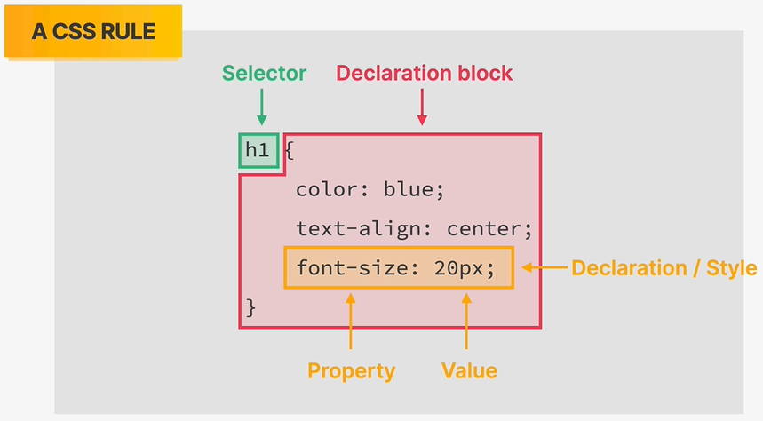
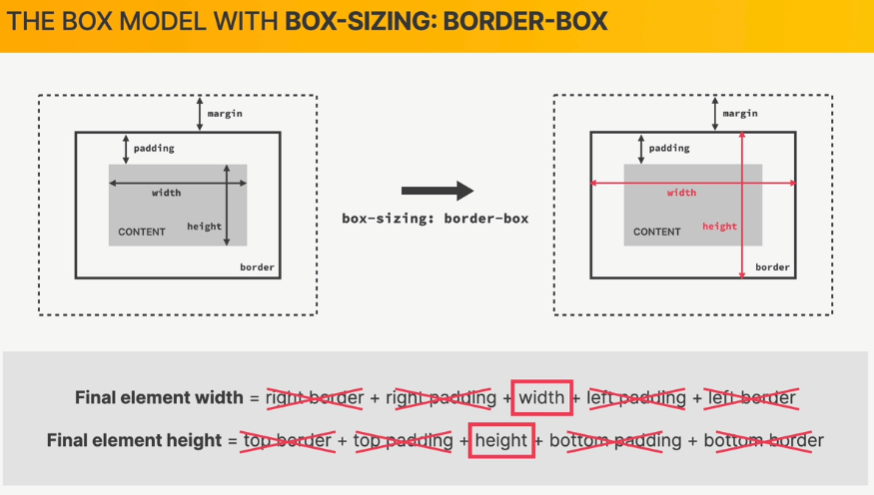

## Udemy Course: "Build Responsive Real-World Websites with HTML and CSS"

**Table of Contents**

[TOC]

### Instructor: Jonas Schmedtman

https://www.udemy.com/course/design-and-develop-a-killer-website-with-html5-and-css3/


## Summary

Kurset er et hands-on begynderkursus for HTML og CSS og dækker 4 store emner: Web Design, HTML, CSS og Responsive Design

## Den røde tråd

Først HTML, så CSS, så layout, så web design og layout patterns, hvor han pointerer, at det er relevant at være god til både design og implementering, og at der i øvrigt ikke er mange, der er det. Til sidst er der et stort hands-on projekt: Omnifood, hvor man bruger alle de ting, man har lært, til et web site, der er lækkert og responsivt.

Bemærk i øvrigt, at hvis man har godt styr på kerneteknologierne html, css og java script, er man uafhængig af værktøjer som Wordpress og Wix til at lave hjemmesider.

### Section 1: Welcome & First Steps

Indledning, Hello-World eksempel og praktiske ting såsom opsætning af udviklingsmiljø, hvor han bruger VS Code.

#### Course Structure and Projects

En ret god lecture, hvor han giver et overblik over strukturen for kurset, den røde tråd præsentation af de projekter, der gennemgås.

#### Read Before You Start!

Bare en slide med Information om kursusmateriale (såsom GitHub repository: https://github.com/jonasschmedtmann/html-css-course), Discord community, resourcer (såsom hans eget site med masser af ressourcer: https://codingheroes.io/resources/) og tips.

#### A High-Level Overview of Web Development

Han fortæller om, hvordan det grundlæggende fungerer, når man browser på nettet. Man sender et web **request** til en server, som så sender et **response**, der består af **html**-filer, **css**-filer, **javascript**-filer og f.eks. billedfiler. Bemærk, at der også sendes javascript kode til klienten. Generelt gælder i øvrigt, at browseren hos klienten forstår netop disse 3 sprog (html, css og javascript), så responset skal altid være på den form. Man refererer også ofte til disse 3 teknologier som **"front-end-teknologier"**. Han forklarer, hvad et **"static website"** er - det er et website, hvor man bare kopierer de html, css og js filer, der ligger på serveren, til browseren.

En **"dynamic website"** er kendetegnet ved at den løbende *genererer* de html-, css- og javascript-filer, der sendes til klienten. For et dynamisk website har man en mere sofistikeret backend, der baserer sig på **"backend-teknologier"** som f.eks. node.js, php eller python.


HTML beskæftiger sig med *content*. CSS beskæftiger sig med *styling* og layout. JavaScript er selve programmeringssproget, og tillader os at *ændre* content eller styling og generelt at lave dynamiske effekter.

#### Setting Up Our Code Editor

Så kommer han med nogle anbefalinger mht hvordan man kan sætte Visual Studio Code op:

Extensions:

* Prettier - formatterer koden, hver gang man gemmer
* One Monokai Theme - Highlighter kode i bestemte farver. Husk at klikke knappen: "Set Color Theme" efter installering.

Settings (åbn ved at klikke på møtrikken nederst til venstre i brugergrænsefladen):

* I Settings: Skriv "default formatter" i filteret. Sæt her Default formatter til Prettier
* I Settings: Skriv "format on save" i filteret. Check her checkboksen 'Format On Save'
* I Settings: Skriv "auto save" i filteret. Sæt her Auto Save til 'onFocusChange'
* I Settings: Skriv "tab size" i filteret. Sæt her Tab Size til 2
* I Settings/Themes/Color Theme: Sæt color scheme til et eller andet
* I Settings/Themes/File Icon Theme:  Vælg "Seti"

Bemærk, med VS Code arbejder man altid i en folder, som i øvrigt benævnes "Project folderen"

Øvelse: Lav en projektfolder og opret heri en tom fil ved navn index.html. Indtast i filen et udråbstegn og tryk derefter på tab-tasten - så får man den standard html struktur, som er vist nedenfor:

```html
<!DOCTYPE html>
<html lang="en">
<head>
  <meta charset="UTF-8">
  <meta name="viewport" content="width=device-width, initial-scale=1.0">
  <title>Document</title>
</head>
<body>
  
</body>
</html>
```

Her kan man så f.eks. ændre titlen og tilføje en header og en paragraph i body elementet som vist nedenfor:

```html
<!DOCTYPE html>
<html lang="en">
  <head>
    <meta charset="UTF-8" />
    <meta http-equiv="X-UA-Compatible" content="IE=edge" />
    <meta name="viewport" content="width=device-width, initial-scale=1.0" />
    <title>My first webpage</title>
  </head>
  <body>
    <h1>Hello World!</h1>
    <p>My name is Ebbe, and this is my first webpage</p>
  </body>
</html>
```

Han anbefaler i øvrigt at placere VS Code side om side med en Chrome browser, hvor man kan se sin web side, mens man arbejder på html-koden.

Han anbefaler at bruge et website, der heddeer CodePen: https://codepen.io/. Det er et forum, hvor man kan stille spørgsmål og udveksle erfaringer med andre frontend-udviklere. Derudover giver han nogle generelle studietips.

### Section 2: HTML Fundamentals

Her gennemgår han HTML basics ved at kode en web page med en kort popular-style artikel om HTML med nogle billeder, links osv.

#### Section Intro

Han præsenterer øvelsen. Han refererer i den forbindelse til HTML som det fundamentale sprog i web development, og nævner, at HTML, CSS og Java Script udgør de 3 core technologies i web development.

#### Introduction to HTML

Han introducerer HTML og begrebet HTML element, som HTML pages er bygget af samt strukturen for HTML elementer med opening og closing tags.

#### HTML Document Structure

Han nævner, at main page for et web site altid bør hedde index.html. Et html document har en hierarkisk struktur med et `html` element som sit main element, som indeholde de 2 child elementer `head` (ikke at forveksle med `header`, som er et andet element) samt `body`, som så indeholder et væld af andre html elementer.

#### Text Elements

Han introducer heading elementerne `h1` til `h6`. Han understreger, at en page kun bør have èn `h1` heading! Han snakker også om paragraph elementet `p`.

Han viser, hvordan man kan operere med kommentarer i html filer med syntaxen `<!-- bla bla -->`. 

Han demonstrerer bold elementet `b`, som kan bruges til at ændre fonten for noget tekst til fed. I den forbindelse nævner han, at elementet `b` ikke har såkaldt "semantisk betydning", og at man derfor bør benytte strong elementet `strong`.

Til sidst demonstrerer han emphasize elementet `em`, som har semantisk betydning og gør tekst kursiv (italic).

#### More Text Elements: Lists

Han introducerer ordered list elementet `ol`, som svarer til en numbered list i f.eks. Word. En ordered list har et antal child elementer af type list item, `li`. Han introducerer også varianten unordered list `ul`, som svarer til en bullet list i Word.

#### Images and Attributes

Han introducerer image elementet `img`, som i øvrigt ikke har noget closing tag. Han benytter lejligheden til at introducere *attributter*, som knytter sig til html elementer. Image elementet har f.eks attributterne `src`, `alt` og `width`.

#### Hyperlinks

Han introducerer "anchor" elementet `a` som bruges til at lave hyperlinks i et html dokument, hvor man angiver url´en i anchorets `src`-attribute. Han nævner i øvrigt at den side, som han linker til (https://developer.mozilla.org/en-US/docs/Web/HTML), er meget nyttig mht som web developer at finde information om html. Han bemærker, at hvis man sætter anchorets "target" attribute til "_blank" udvirker det, at der åbnes en ny side, når der klikkes på linket.

Dernæst viser han, hvordam man kan linke til et andet html dokument på samme web site. Det er lidt anderledes end at linke til url'er på internettet, derved at man bruger attributten `href`og ikke `src`. Han bemærker også at man kan lave et placeholder link ved at sætte href attributten til "#", hvilket kan være nyttigt, mens man arbejder på en web page.

#### Structuring our Page

Han introducerer container elementerne: `nav` (navigation), `header`, `article` og `footer`. De bruges til at strukturere og gruppere andre elementer i logiske enheder, hvilket er vigtigt af hensyn til semantisk html og også styling med css.

#### A Note on Semantic HTML

Han uddyber, hvad semantic html er. Det handler om, at man ikke bare skal beskæftige sig med, hvordan html elementer tager sig ud på en webside. Det er også vigtigt at beskæftige sig med, hvad de *betyder*. Det faciliterer f.eks. search engine optimization og accessibility, der f.eks. henvender sig til blinde, der benytter screen readers.

#### Installing Additional VS Code Extensions

Ud over de VS Code extensions, han demonstrerede i indledningen, anbefaler han her at installere følgende:

* image preview (gør, at der vises et lille preview af billedet i "gutteren" af Explorer panelet i VS Code)
* Color Highlight (nyttigt til at visualisere farver i CSS)
* Auto Rename Tag (gør, at closing tag automatisk ændrer sig, hvis man ændrer opening tag for et element)
* Live Server (meget populær extension, som gør, at der popper en "Go Live"-knap op i bunden af VS Code - hvis man klikker på den åbnes html siden i et browser vindue, som opdateres, hver gang man saver sit html dokument)

#### Challenge #1

Her introducerer han html elementer `aside`, som bruges til "secondary information that complements the information in the main part of the page". Opgaven går ud på over footeren at lave en aside sektion med en bulleted list, der indeholder nogle lidt mere komplekse list item elementer, der hver har et billede, et link og noget tekst.

#### Challenge #2

Her foreslår han at man arbejder med endnu en challenge, der handler om at lave en lille reklameside for et par sko. Han foreslår i øvrigt at gøre det på web sitet CodePen, som han nævnte tidligere: https://codepen.io/. Det virker egentlig ret let og minder om det at køre VS Code med extensionen Live Server. I øvrigt er det et fint forum til at udveksle kode og spørge om hjælp.

### Section 3: CSS Fundamentals

Her gennemgår han CSS basics ved at arbejde videre på den artikel, der også blev brugt i de indledende kapitler.

#### Section Intro

Han introducerer CSS, som mestendels handler om *styling* af det indhold, der skrives i html.

#### Introduction to CSS

Man har som regel et antal **css rules** defineret i en særskilt fil med extensionen css, som man så kan referere til fra en html-fil. En css rule er struktureret som vist nedenfor. Den består den af en **Selector** (som kan være af flere forskellige typer) samt en **Declaration block**, der omfatter et antal **Declarations**, også bare kaldet **Styles**. En declaration består af en **css property** med en værdi.



#### Inline, Internal and External CSS

Der er 3 måder hvorpå css kan specificeres: inline, internal og eksternal. Med *inline* specificerer man style i individuelle html-elementer. Med *internal* specificerer man det i en blok i html-dokumentets head-element. Med *external* specificerer man det i en særskilt css-fil, som man refererer til fra et style element i html-dokumentets head-element. External er så klart den bedste praksis.

#### Styling Text

Her demonstrerer han, hvordan man kan style text med forskellige css properties, som illustreret nedenfor:

```css
h1 {
    color: blue;
    font-size: 26px;
    font-family: sans-serif;
    text-transform: uppercase;
    font-style: italic;
}

p {
    font-size: 26px;
    font-family: sans-serif;
    line-height: 1.5;
}
```

#### Combining Selectors

Han demonstrerer, hvordan en css rule kan specificere en style for et antal forskellige typer af html elementer under anvendelse af en såkaldt **list selector**, som illustreret nedenfor:

```css
h1, h2, h3, h4, p, li {
    font-family: sans-serif;
}
```

Bemærk, at der stadig er tale om én selector, nemlig en list selector, som bare omhandler flere forskellige html tags.

Han demonstrerer også **descendant selectors**, der kan bruges til på mere kirurgisk vis at ændre style, f.eks. for eksemplet nedenfor, hvor man sørger for, at footers skrives med lille font ved at specificere, at stylen kun handler om paragraph-elementer, der hører under footer-elementer

```css
footer p {
    font-size: 16px;
}
```

Han tilføjer, at man bør være varsom med at bruge descendant selectors, og nærmest bør undgå det, da det kan føre til kode, der er svær at vedligeholde. I stedet anbefaler han at bruge class selectors og id selectors.

#### Class and ID Selectors

Kirurgisk styring af style kan foretages med en hash selector, som gælder for et html element med et givet id, som illustreret nedenfor:

```html
<p id="author">Posted by <strong>Laura Jones</strong> on Monday, June 21st 2027</p>
```

```css
#author {
	font-style: italic;
}
```

Bemærk, at det altså hedder en hash selector og ikke en id selector. Bemærk også, at den starter med et hash tag.

Et element id skal være unikt i et html dokument, så hash selectoren påvirker et individuelt element i et html dokument. Attributten class derimod kan sættes til samme værdi for flere html elementer, og disse elementer kan derefter styles med den såkaldte class selector, som illustreret nedenfor:

```html
<p class="related-author">By Jim Dillon</p>
<p class="related-author">By Jonas Schmedtmann</p>
```

```css
.related-author {
    font-size: 18px;
    font-weight: bold;
}
```

Bemærk, at class selectors starter med punktum.

I praksis bruger man sædvanligvis altid class selectors frem for hash selectors, også fordi de er mere genbrugelige.

#### Working With Colors

Styling med farver. Nedenfor ses nogle eksempler på hvordan man kan specificere værdier for farve-properties såsom 'color' eller  background-color i css:

```css
color: orange;
color: rgb(0, 255, 255);
color: rgb(0, 255, 255, 0.3); /* med alfa-værdi for transparency */
color: #00ffff; /* hexadecimal notation*/
color: #0ff /* (shorthand hexadecimal notation - eksemplet her svarer til #00ffff) */
```

Han nævner også, at man kan have gavn af at bruge VS Codes color picker tool. Han bemærker i øvrigt, at hvis der er forskellige modstridende css rules for samme element, så er det den seneste, der gælder.

#### Pseudo-classes

Man kan knytte en såkaldt **pseudo class** til en selector for at påvirke udvalgte child elementer for et givet parent element. Det kan f.eks. bruges til at style en liste med alternerende farver som i eksemplet nedenfor:

```css
li:nth-child(odd) {
  color: grey;
}
```

Pseudo classes er specielt brugbare, når alle child elementer for et givet element er ens, som f.eks. for en list, men er ikke så intuitive, når et element har forskellige child elements, som f.eks. i en tilfælde som dette:

```css
article p:first-child {
  color: red;
}
```

..dette virker kun, hvis første child element for article elementet er en paragraph.

#### Styling Hyperlinks

Pseudo classes kan f.eks. bruges til at style hyperlinks ud fra forskellige states, afhængigt af, om brugeren f.eks. hover over eller klikker på dem med musen.

#### Using Chrome DevTools

Man aktiverer development tools i sin Chrome browser ved at højreklikke på et element eller bare et sted på web pagen og så klikke "Inspect" eller "Undersøg" i context menuen. Så får man et view med en masse forskellige tabs.

Den første tab hedder **"Elements"**, og her kan man f.eks. se html koden for siden. Man kan endda få highlighted html elementer og deres margin og padding i viewet ved at hovere musen over elementets underliggende html element i html-koden, hvilket er ret nyttigt. Elements-tabben har også en vigtig sektion, der hedder "Styles" eller, hvor man kan inspicere, hvilke css rules der påvirker et givet element, som man klikker på ovre i html-kode-viewet. Man kan endda manipulere stylingen ved at tilføje, aktivere og deaktivere styles med Dev Tools, hvilket kan være nyttigt for at teste ting under udvikling. Desuden kan man simulere states som f.eks. hover for et element for at force en given styling. Styles sektionen omfatter også den såkaldte css box model beskrevet senere, som kan bruges til inspektion af dimsionerne af content, padding, border og margin for et element. 

Han kommer ikke omkring de andre tabs her, men han nævner, at DevTools er "absolutely essential" for at lave et web site på en effektiv måde.

#### CSS Theory #1: Conflicts Beween Selectors

Her snakker han om, hvad der sker, når flere forskellige css rules dækker samme html element. Som udgangspunkt gælder alle regler, og det er meget normalt, at de supplerer hinanden, men hvis de er uenige om en property som f.eks. font-size, bruges kriterierne illustreret nedenfor til at afgøre, hvilken style der så gælder:


Det er åbenbart meget almindeligt at selectors er uenige, så det er vigtigt at kunne gennemskue, hvorfor en given selector vinder. Man har mulighed for at gennemtvinge noget med ID selectors eller en endnu stærkere mekanisme, der går på at skrive `!important` efter en given css declaration, men man bør prøve at undgå disse 2 metoder. 

#### CSS Theory #2: Inheritance and the Universal Selector

Inheritance i css går på, at html elementer generelt får den samme style som deres parent elementer i den hierarkiske html struktur. Man kan f.eks. sætte nogle properties for body-elementet i et html dokument. Det gælder ikke for alle elementer, men i hvert fald for dem, der omhandler tekst. Hvis der er "konfliktende" styles, har nedarvede styles lav prioritet.

Han introducerer også den såkaldte **universal selector**, som en slags wildcard selector, der gælder for alle html elementer, og som har en lav prioritet i forhold til andre selectors. Der opereres i øvrigt ikke med nedarvning for den universelle selector.

#### Challenge #1

#### CSS Theory #3: The CSS Box Model

Han introducerer the **"CSS Box Model"** og nævner, at det er et af de mest fundamentale koncepter i CSS. Den illustreres nedenfor og går på, at ethvert element repræsenteres af et rektangulært område på skærmen. Der benyttes de samme koncepter med border, padding og margin som i wpf.

 

#### Using Margins and Paddings

Man bruger padding ved at skrive en css declaration som den nedenstående, som så gælder hele vejen rundt om et givet element:

```css
padding: 20px;
```

Box modellen vises i øvrigt i DevTools under Elements-tabben, som vist nedenfor:


Man kan holde musen over de forskellige områder for at fremhæve de tilsvarende områder i browser viewet.

Padding kan også sættes forskellige for de forskellige sider, som illustreret nedenfor:

```css
padding: 20px; /* Gælder hele vejen rundt */
padding-left: 40px; /* Overrider for venstre side (de andre 3 sider har så stadig en padding på 20px) */
padding-right: 40px; /* Overrider for højre side */
padding: 20px 40px; /* Shorthand property, der giver samme resultat som de ovenstående 3 linier */
```

Han nævner, at en populær teknik er at bruge en såkaldt global reset, hvor man for den universelle selector sætter margin og padding til 0, som vist nedenfor;

```css
* {
  margin: 0;
  padding: 0;
}
```

Så erstatter man alle default paddings og margins med 0, hvilket gør siden meget kompakt, og så kan man style den derfra. Han sætter nogle værdier for margin-bottom for nogle af de css rules, der er. Han bemærker i øvrigt, at to margener, der dækker over hinanden, som f.eks hvis man har et element med en nedre margen over et element med en øvre margen, så deler de 2 margener området, således at den største af dem bliver gældende, frem for at man har en effektiv margen svarende til summen af de 2 margener. Det kalder man for **"collapsing margins"**.

Han nævner, at han foretrækker at have css rules for de største elementer såsom nav og article i toppen af sine css-filer.

Han summerer med at sige, at padding er mest relevant, hvis man f.eks. har elementer med en baggrundsfarve, som gerne må fylde lidt mere, mens margin er velegnet til at skabe plads mellem elementer. Som et sidste tip anbefaler han så vidt muligt at skabe vertikal spacing under anvendelse af margin-bottom frem for margin-top og så vidt muligt prøve at undgå at mixe de 2.

#### Adding Dimensions

Nu demonstrerer han, hvordan man kan sætte dimensionerne, dvs width og height for *content*-delen af html-elementerne, dvs det inderste af css box modellen. Det er f.eks. nyttigt for nogle af de elementer, der har en baggrund samt for billeder. Hvis man sætter bare den ene dimension for et billede, følger den anden sædvanligvis med for at bevare aspect ratio, men hvis der er flere selectors i spil, kan det at sætte den ene dimension gøre, at aspect ratio ændres. Det kan man rette op på ved at sætte den anden dimension til auto, hvilket gør, at aspect ratio for det originale billede bibeholdes.

Han demonstrerer i øvrigt, hvordan man frem for at sætte f.eks. width til et antal pixels, som vi har gjort indtil nu, kan sætte den til en procentdel af den tilgængelige plads, som illustreret nedenfor:

```css
.post-img {
  width: 100%;
  height: auto;
}
```

#### Centering our Page

Nu viser han så et trick til at centrere content. Det handler om at placere det, man gerne vil have centreret, i et container element, som passende kan være `div`, som er et general purpose container element uden semantisk betydning. 

#### Challenge #2

Her anbefaler han igen at man bruger de teknikker, man har lært, til at style skoreklamen fra tidligere. 

#### CSS Theory #4: Types of Boxes

Her taler han om, hvilke forskellige typer af **"boxes"**, der eksisterer i CSS box modellen. Mht layout opfører et html element sig på en måde, der afhænger af hvilken **"box type"** det har. Der opereres med de 3 forskellige box types: **"block-level"**, **"inline"** og **"inline block"**. De forskellige typer af html elementer har som udgangspunkt en default box type, som man imidlertid kan override med en css rule, hvis man ønsker en bestemt effekt såsom at placere anchors under hinanden i stedet for efter hinanden, eller såsom at placere list items efter hinanden i stedet for under hinanden.

Elementer med box typen *block-level* er kendetegnet ved at de udfylder den plads, der er tilgængelig. Block level elementer kan ikke være side om side men placeres *under* hinanden. De fleste html elementer har block level som default box type. Som eksempler herpå kan nævnes body, main, header, footer, section, nav, aside, div, h1-h6, p, ul, ol, li, article osv.

Elementer med box typen *inline* er kendetegnet ved at de ikke fylder mere end de behøver, uanset hvor meget plads der er til rådighed. I modsætning til block level elementer danner de ikke et line break efter sig. CSS declarations for width og height påvirker ikke inline elementer. CSS declarations for padding og margin påvirker kun inline elementer fsa den horisontaledel, dvs for left og right. Som eksempler herpå kan nævnes html-elementerne strong, a, em, button osv.

Til sidst er der elementer med box typen inline block, som kombinerer egenskaber for de 2 første box typer. Man kan f.eks. få vertikale margins og paddings til at gælde for inline elementer ved at sætte deres box type til inline block. Image er et eksempel på et element med box typen inline-block. Man kan override box-typen for en givet elementtype ved assigne en css declaration for propertyen display, som i eksemplet vist nedenfor:

```css
nav a:link {
  display: inline-block;
}
```

#### CSS Theory # 5 Absolute Positioning

Normalt positioneres html elementer i henhold til såkaldt **"normal flow"**, hvilket indebærer, at de placeres i henhold til deres rækkefølge i html koden. Det er imidlertid også en mulighed at benytte såkaldt **"absolute positioning"** for et element. Sådan et element placeres under anvendelse af css declarations for top, bottom, left og right. Man skal også lave en css declaration, hvor man sætter propertyen position til absolute og nok så vigtigt sætte propertyen position til relative for det pågældende parent element, som illustreret nedenfor:

```css
.container {
  position: relative;
}

button {
  bottom: 20 px;
  right: 20 px;
  position: absolute;
}
```

Han nævner, at man sædvanligvis kun bruger absolute positioning til finishing touches og ikke som bærende teknik for layout.

Han kommer i øvrigt med et sjovt lille hint, som går på at man kan trykke Windows tast + punktum for at lave en emoji karakter som en del af teksten f.eks. i en button element.

#### Pseudo-elements

"Pseudo elements are elements that don't exist in the HTML but that we can still select and style in CSS". Nedenfor ses et eksempel, hvor man styler første bogstav i en heading med pseudo-elemetet first-letter:

```css
h1::first-letter {
  font-style: normal;
  margin-right: 5px;
}
```

I eksemplet nedenfor bruger vi pseudo-elementet first-line til at style den første linie i de paragraf elementer, der kommer lige efter h3 elementer. Vi bruger i øvrigt også en såkaldt **"next sibling selector"**, som ikke targetter selve h3 elementer men derimod de efterfølgende p elementer på samme niveau som h3 elementerne:

```css
h3 + p::first-line {
  color: red;
}
```

I eksemplet nedenfor bruger vi pseudo-elemetet after til at placere en lille tekst label efter et h2 element. Bemærk, at vi har en content property og at vi har ændret box type til inline-block, for at kunne bruge vertikal padding, da pseudo-elementer pr default er inline. Desuden bruger vi absolute positioning samt negative tal for positionen.

```css
h2 {
  position: relative;
}

h2::after {
  content: "TOP";
  background-color: #ffe70e;
  color: #444;
  font-size: 16px;
  font-weight: bold;
  display: inline-block;
  padding: 5px 10px;
  position: absolute;
  top: -10px;
  right: -25px;
}
```

#### Developer Skill #1: Googling and Reading Documentation

Her giver han tips til at søge efter HTML og CSS tips med Google og fremhæver StackOverflow samt MDN (developer.mozilla.org).

#### Developer Skill #2: Debugging and Asking Questions

Her giver han tips til at debugge CSS. Ofte kommer der fejl ud af at man glemmer at lukke sine html elementer med et closing tag. Man kan også bruge et HTML validator tool som f.eks. https://validator.w3.org/ til at checke om ens html overhovedet er valid. Han anbefaler også at bruge https://www.diffchecker.com/ som er et general purpose tool til at sammenligne tekstfiler som i nogle situationer kan være nyttigt over for HTML- eller CSS-filer.

I CSS er problemet ofte konfliktende selectors. Her er Chrome Dev Tools ret nyttige til at inspicere, hvilke selectors, der gælder.

#### Challenge #3

Her anbefaler han igen at man bruger de teknikker, man har lært, til at style skoreklamen fra tidligere. 

### Section 4: Layouts: Floats, Flexbox, and CSS Grid Fundamentals

Her gennemgår han layout teknikker med fokus især på flexbox og css grid og demonstrerer det ved at style artiklen fra de tidligere kapitler og desuden ved at lege med nogle små playgrounds med nogle farvede kasser. Bemærk, at der er links til de 2 playgrounds fra html-artikel-eksempler.

#### Section Intro

Han siger, at kapitel 3 handlede meget om basic css, mens dette kapitel tager det videre til næste niveau, der handler om at bruge CSS til layout for web pages.

#### The 3 Ways of Building Layouts

**"Page layout"** handler om hvordan man arrangerer **"components"** på en web page, mens **"Component layout"** handler om hvordan man arrangerer html elementer i en komponent eller. Traditionelt layouter man under anvendelse af **"float layouts"**, som ikke bruges så meget mere. Til gengæld bruger man i stor stil **"Flexbox"** og **"CSS  Grid"** til layout. Flexbox er god til en-dimensionelle rækker mens css grid er god til 2-dimensionelle grids.


#### Using Floats

Dette er som nævnt den traditionelle måde at layoute på. Man kan gøre et html element til et floated element ved at targette det med en css rule med en declaration, hvor propertyen float er sat til f.eks. left eller right (ikke top eller bottom). Det minder lidt om absolute positioning derved at elementet kommer til at være "out of flow", men det influerer dog på andre elementer, der vil "wrappe rundt om" det floatede element - det minder om word, hvor man kan lade noget tekst flyde rundt om et billede. Der gælder i øvrigt, at container elementer ikke vil tilpasse deres højde til et floated element - det kan medføre, at højden af container elementet kollapser, hvis det kun indeholder floatede elementer.

I praksis kan man f.eks. bruge denne layout metode til at placere block-level elementer horisontalt efter hinanden, hvor de ellers ville blive placeret under hinanden, da de jo normalt udfylder hele den tilgængelige plads.

#### Clearing Floats

Her beskriver han nogle teknikker til at løse problemet med at floated elements kan få deres container element til at kollapse. En af teknikkerne refererer han til som "the clearfix hack", som I mange år har været brugt i CSS communityet. Det ser ud som vist nedenfor:

```
.clearfix::after {
  clear: both;
  content: "";
  display: block;
}
```

Det er mest relevant at kende, hvis man kommer til at skulle vedligeholde gamle css-filer.

#### Building a Simple Float Layout

Han indleder med at anbefale midlertidigt at ændre baggrundsfarven for sine elementer så det er tydeligt hvor de er.

Så styler han artiklen om html ved at lade article-elementet floate til venstre, aside elementet floate til højre. Det udvirker så umiddelbart, at footer-elementet placeres lige under aside-elementet, fordi det wrapper rundt om det, men det kan han fixe ved at associere footer elementet med en style, hvor clear er sat til both.

Han siger, at det ikke er super intuitivt at arbejde med float layout, hvilket er en af hovedårsagerne til at man introducerede flexbox og css grid.

#### box-sizing: border-box

Her snakker han om hvordan man kan fixe små problemer med box modellen såsom at content ikke er alignet som man gerne vil have det. Ofte skyldes det den default adfærd (kaldet **"content-box"**), som box modellen har med at et elements bredde og højde fås ved at addere værdierne for content, padding, border og margin. Hvis man ændrer adfærden til **"border-box"** som vist nedenfor, tvinger man så at sige boxens højde og bredde til at være som specificeret i css. Bemærk, at det foregår ved at reducere størrelsen af content, dvs den inderste del af box modellen. 

```css
aside {
  box-sizing: border-box;
}
```

Princippet er illustreret i figuren nedenfor:



Han nævner i øvrigt, at det er en teknik, som rigtig mange benytter sig af - rent faktisk er det normalt at benytte det for alle elementer ved at placere stylen i den universelle selector, som vist nedenfor:

```
* {
  box-sizing: border-box;
}
```

#### Challenge #1

Her anbefaler han igen, at man bruger de teknikker, man har lært, til at style skoreklamen fra tidligere. 

#### Introduction to Flexbox

At bruge flexbox foregår ved at man styler et container element ved at sætte display-propertyen (dvs den samme property, som kan bruges til at override box type for et element) for elementet til `flex`, som illustreret nedenfor

```css
.container {
  display: flex;
}
```

Det influerer så på, hvordan child elementerne for pågældende container element arrangeres. Han demonstrerer, hvordan man f.eks. på denne måde kan ændre på layout for et container element med et antal div-elementer, hvor de pr default placeres under hinanden, men med flexbox placeres horisontalt i forlængelse af hinanden. Alle elementer får herved en højde svarende til det højeste element.

Han demonstrerer herefter, hvorledes man let f.eks. kan aligne child elementer ved at sætte forskellige propertyen på parent containeren, som vist nedenfor:

```css
.container {
  display: flex;
  align-items: center;
  /* justify-content: space-between;
  justify-content: space-evenly; */
  justify-content: center; 
}
```

#### A Flexbox Overview

Her giver han en mere grundig gennemgang af flexbox. Der gælder reglerne vist nedenfor:


Han siger, at man med en flexbox opererer med en **"main axis"**. som kan være horisontal eller vertikal. Den vinkelrette akse kaldes **"cross axis"**. Nedenfor er der et nyttigt cheat sheet. Bemærk, at højre side handler om at man kan sætte properties på child elementerne, som man i øvrigt kan referere til som **"flex items"**, når de befinder sig inde i en **"flex container"**.


#### Spacing and Aligning Flex Items

Her begynder vi så at arbejde med flexbox. Først demonstrerer han, hvordan man kan override flex alignment for udvalgte child elementer. Dernæst demonstrerer han, hvordan man kan ændre rækkefølgen af elementer. Han nævner i øvrigt, at dette kan være relevant i forbindelse med at tilpasse et layout i forhold til en mobil skærm, der jo sædvanligvis er mindre end for f.eks. en monitor.

Så demonstrerer han, hvordan man kan sætte en gap property for flex containeren for at lave mellemrum mellem flex items.

#### The flex Property

Her introducerer han den såkaldte **"flex"** property, som kan sættes for child elementer i en flex container. Propertyen er faktisk en shorthand property, der dækker over de 3 properties vist nedenfor inkl deres default værdier:

```css
.el {
  flex-grow: 0;
  flex-shrink: 1;
  flex-basis: auto;
}
```

Flex basis bruger man sædvanligvis til at sætte bredden af flex elementer - det er faktisk mere almindeligt at bruge flex basis end at bruge width. Flex basis kan ses som en anbefaling snarere end et dekret - hvis et child elements bredde er større end flex basis, ændres dets bredde ikke, men hvis bredden er mindre, forlænges det, så det får en bredde svarende til flex basis. Det gælder dog kun, hvis bredden af flec containeren er stor nok. I modsat fald sker der pr default det at child elementerne shrinkes så de kan være i containeren (det fremgår f.eks. hvis man sætter flex-basis til et stort tal). Det er i øvrigt konkret pga propertyen flex-shrink og dens default værdi på 1. Ændrer man flex-shrink til 0 forhindrer man denne shrinking, men så kan der ske det at rækken af child elementer vokser ud af containeren. Den sidste af de 3 properties: flex-grow er en art modsætning til flex-shrink, for her får child elementerne lov til at gro indtil de fylder den tilgængelige plads ud. Pr default er flex-grow-værdien for hvert child element 1 og det indebærer, at de kommer til at fylde lige meget, men hvis man f.eks. bare sætter værdien for ét af elementerne til 2 får den lov at fylde dobbelt så meget som de andre ud af den tilgængelige plads. På den måde minder det rigtigt meget om wpf, hvor man bruger width: 2*, width: * til samme effekt.

Til sidst nævner han, at man i praksis som regel altid bruger shorthand propertyen fremfor at bruge de 3 properties direkte, som illustreret nedenfor:

```css
.el {
  flex: 1 0 200px;
}
```

Hvis man f.eks. kun vil ændre flex-grow, skriver man det som vist nedenfor, hvor den så bruger default værdierne for flex-shrink og flex-basis:

```css
.el {
  flex: 1;
}
```

#### Adding Flexbox to Our Project

Nu demonstrerer han så hvordan vi kan bruge flexbox for layoutet på artiklen i stedet for Float. Det bliver temmelig rodet i  css filen hvor han i vidt omfang bare overrider tidligere css rules. Han styler main-header, author-box og aside-sektionen, som han i øvrigt efterlader i bunden, selv om han havde hevet den op i højre side.

#### Building a Simple Flexbox Layout

Her demonstrerer han så hvordan vi kan lave et mere overordet flexbox layout, hvor aside-sektionen f.eks. kommer op i højre side.

Specifikt laver han en overordnet flex box, der indeholder de 2 elementer article og aside. Så sætter han asiden elementetes bredde til 300px, et gap på 75px og lader artiklen fylde så meget den kan ved at sætte dens flex-grow property til 1. I øvrigt sætter han flex boxens align-items property til flex-start for at undgå, at den bliver lige så lang som artiklen, da default værdien for align-items er stretch.

#### Challenge #2

Her anbefaler han igen, at man bruger de teknikker, man har lært, til at style skoreklamen fra tidligere. Introduction to CSS Grid

#### Introduction to CSS Grid

Her kører han lige en hands-on introduktion til CSS Grid.

Indledningsvis demonstrerer han, hvordan man kan skjule et helt element med en style, hvor propertyen display er sat til none, som illustreret nedenfor:

```css
.container--2 {
  display: none;
}
```

(det gør han bare for at få den anden conatiner af vejen). Så styler han den synlige container og dennes items med følgende css rule:

```css
.container--2 {
  display: grid;
  grid-template-columns: 200px 200px 150px 150px;
  grid-template-rows: 300px 200px;
  /* gap: 30px; */
  column-gap: 30px;
  row-gap: 60px;  
}
```

Bemærk, at der laves lige så mange rækker, som det er nødvendigt for at akkomodere de elementer, man har, så siden der er 4 kolonner og 8 items laves der 2 rækker. Hvis man tilføjer et 9. item laves der en række mere, som i øvrigt bliver så lav som muligt siden der kun er en specifikationer for højde for de 2 første rows i eksemplet.

Lige som man siger at man har en flex container med flex items siger man også, at man har en grid container med grid items.

#### A CSS Grid Overview

Her gennemgår han noget teori og terminologi omkring css grids. Han understreger, at den ikke erstatter men derimod supplerer flexbox.


Han introducerer termerne **"grid line"**,  **"grid cell"**, **"grid track"** og **"column track"**. Lige som for flex box viser han nedenstående cheat sheet for css grid:


#### Sizing Grid Columns and Rows

Han demonstrerer, hvordan man kan sørge for at en column udfylder den tilgængelige plads i stedet for at fylde et bestemt antal pixels ved at bruge `fr` i værdierne i stedet for `px`, som vist nedenfor:

```css
.container--1 {
  grid-template-columns: 200px 200px 1fr 1fr;
}
```

Det minder meget om flexbox hvor man kan sætte flex-grow værdierne for de forskellige child elementer og wpf hvor man bruger wildcards. Det virker på samme måde at man f.eks. kan skrive `2fr` hvis et element skal fylde dobbelt så meget af den tilgængelige plads end et element, hvor der står `1fr`.

Man kan også skrive `auto` hvis en kolonne kun skal fylde så meget som den lige akkurat behøver. Det er igen helt ækvivalent til wpf.

Han præsenterer også lige en alternativ notation, som især er nyttig, når der er mange columns:

```css
.container--1 {
  grid-template-columns: repeat(4, 1fr);
}
```

Man kan også bruge `fr` og `auto` for rækker, og så kan det være gavnligt at sætte højdn for grid containeren - ellers er det i praksis største element, der afgør, hvad `1fr` svarer til.

#### Placing and Spanning Grid Items

Her demonstrerer han, hvordan man placerer et grid item hvor man vil i stedet for at det sker automatisk. Det gør man ved at sætte nogle properties på de enkelte grid items, som i eksemplet nedenfor:

```css
.el--8 {
  grid-column: 2 / 3;
  grid-row: 1 / 2;
}
```

De resterende grid items bliver bare placeret, hvor der er plads, dvs hvor der ikke er nogen "reservation" til et givet grid item.

Eksemplet ovenfor kunne man i ørigt bare have skrevet således:

```css
.el--8 {
  grid-column: 2;
  grid-row: 1;
}
```

fordi default placering er, at man fylder pågældende celle ud, men man kan også opnå en placering, hvor et grid item spanner flere grid cells ved at skrive som vist nedenfor:

```css
.el--2 {
  grid-column: 1 / 3;
  grid-row: 1;
}
```

Nedenfor vises en ækvivalent notation, hvor man angiver antallet af celler, et grid item skal spanne over, snarere end nummeret på en grid line:

```css
.el--2 {
  grid-column: 1 / span 2;
  grid-row: 1;
}
```

Man kan også skrive `-1` til højre for skråstregen for at angive, at pågældende grid item skal spanne helt over til enden af grid containeren, som vist nedenfor:

```css
.el--2 {
  grid-column: 2 / -1;
  grid-row: 1;
}
```

-1 er faktisk nummeret på grid linien yderst til højre talt fra venstre, hvor næstyderste grid linie hedder -2 og så fremdelse, så man kan f.eks. også angive, at et grid item skal spanne frem til næstsidste grid line, som vist nedenfor:

```css
.el--2 {
  grid-column: 2 / -2;
  grid-row: 1;
}
```

Man kan i øvrigt også overlappe grid items, selv om det sjældent er relevant i praksis.

#### Aligning Grid Items and Tracks

Her demonstrerer han, hvordan man kan aligne cells og deres content inde i sin grid container, hvilket er særligt relevant, når der er mere plads, end der er brug for, f.eks. når de forskellige tracks har faste værdier for bredde og højde.

Til sidst demonstrerer han, hvordan man ligesom for flex box kan override de generelle settings for children, f.eks med en styling som den vist nedenfor:

```
.el--3 {
  align-self: end;
  justify-self: end;
}      
```

Han bemærker i øvrigt, at keywordet align generelt handler om *vertikal* alignment, mens keywordet justify generelt handler om *horisontal* alignment.

#### Building a Simple CSS Grid Layout

Her restyler han artiklen om html ved at bruge css grid til det overordnede layout i stedet for flexbox. Bemærk, at han bibeholder det med at nogle af elementerne er stylet under anvendelse af flexbox, der jo lever fint i symbiose med css grid.

Han nævner i øvrigt, at man så vidt muligt bør lave spacing med css grid styles såsom row-gap osv frem for at bruge margins, da det er mere rent og lettere at vedligeholde.

#### Challenge #3

Her anbefaler han igen, at man bruger de teknikker, man har lært, til at style skoreklamen fra tidligere.

### Section 5: Web Design Rules and Framework

HVAD ER DEN RØDE TRÅD I DETTE KAPITEL?

#### Section Intro

De første 4 kapitler handlede om web *development*, men dette kapitel handler om web *design*. Han siger, at det er relevant som udvikler at være god til begge dele, og at mange udviklere kun er god til en af delene.

#### Project Overview

#### Overview of Web Design and Website Personalities

#### Web Design Rules #1: Typography

#### Implementing Typography

#### Web Design Rules #2: Colors

#### Implementing Colors

#### Web Design Rules #3: Images and Illustrations

#### Web Design Rules #4: Icons

#### Implementing Icons

#### Web Design Rules #5: Shadows

#### Web Design Rules #6: Border-radius

#### Implementing Border-radius

#### Web Design Rules #7: Whitespace

#### Web Design Rules #8: Visual Hierarchy

#### Implementing Whitespace and Visual Hierarchy

#### Web Design Rules #9: User Experience (UX)

#### The Website-Personalities-Framework

#### The Missing Piece: Steal Like An Artist!


