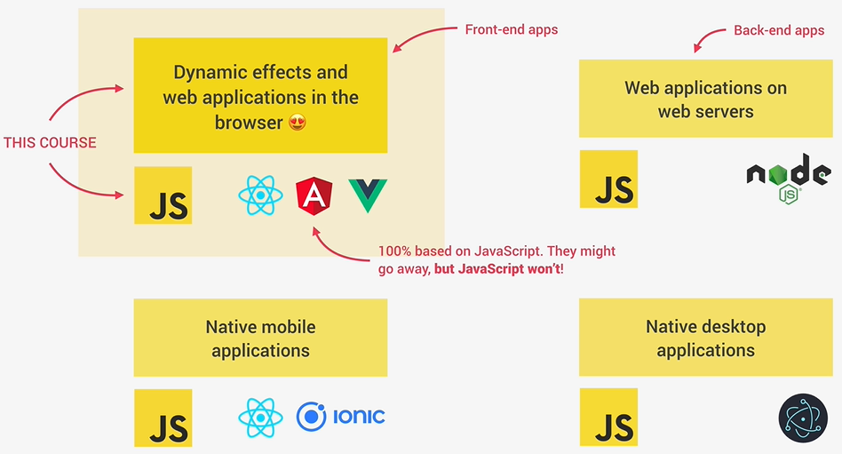

## Udemy Course: "The Complete JavaScript Course 2024: From Zero to Expert!"

Instructor: Jonas Schmedtman

https://www.udemy.com/course/the-complete-javascript-course


## Summary

Kurset er et hands-on begynderkursus for JavaScript

## Table of Contents

[TOC]

### Section 1: Welcome, Welcome, Welcome

#### Course Structure and Projects

Han præsenterer kursets indhold. Han nævner i øvrigt, at JavaScript er det mest populære programmeringssprog i verden.

#### Read Before You Start!

Ressourcer.

#### Watch Before You Start

Gode råd til at få det meste ud af kurset

#### Setting Up Our Code Editor

Han introducerer VS Code. Han anbefaler at installere extensionen Monokau Pro. Han anbefaler at sætte følgende settings for VS Code:

* Auto Save til onFocusChange 
* Aktivere Format on Save (kræver en formatter)

### Section 2: JavaScript Fundamentals - Part 1

#### Section Intro

Kort introduktion til kapitlet

#### Hello World!

Han demonsterer, hvordan man kan skrive og eksekvere noget javascript kode i selve browseren ved at aktivere DevTools, navigere til Console-tabben, indtaste noget kode såsom:

```
alert("Hello world")
let a = 4
```

og trykke enter. Det gør man nok ikke så tit i praksis.

#### A Brief Introdunction to JavaScript

Han forklarer, hvordan JavaScript er en kerneteknologi i web development og et fundament for mange frameworks såsom React, Angular, Vue, Ionic Eletron, Node.js osv. Han argumenterer for, at man som sådan har rigtig god gavn af at dygtiggøre sig i JavaScript.



#### Linking a JavaScript File

Han demonstrerer, hvordan man kan eksekvere noget simpel javascript, som er indlejret i en html fil som såkaldt "inline javascript". I praksis har man dog sædvanligvis javascript kode i en separat fil.

Han bemærker, at det er god praksis at skrive semikolon til sidst på linierne, men at det ikke er påkrævet.

#### Values and Variables

#### Practice Assignments

#### Data Types

#### let, const and var

#### Basic Operators

#### Operator Precedence

#### A Note About Challenges

#### Coding Exercise 1: CHALLENGE #1

#### Strings and Template Literals

#### Taking Decisions: if / else Statements

#### Coding Exercise 2: CHALLENGE #2

### Section 3: JavaScript Fundamentals - Part 2

### Section 4: How to Navigate This Course

Dette er et kort kapitel, hvor han har forslag til hvordan man plukker i kurset, hvis man gerne vil hurtigt igennem.

### Section 5: Developer Skills & Editor Setup

Dette kapitel handler mest om hvordan man effektivt lærer samt arbejder med udvikling og debugging.

#### Section Intro

#### Section Roadmap

#### Setting up Prettier and VS Code

Han giver nogle få anbefalinger vedr VS Code extensions og nævner indledningsvis **Prettier**, som er en "opinionated" formatter, hvilket vil sige, at den opererer med nogle prædefinerede "holdninger" til hvordan kode skal formatteres. Efter installation skal Prettier konfigureres som default formatter. Han demonstrerer i øvrigt hvordan den kan konfigureres, så man kan trække den i retning af ens egen holdninger til hvordan man synes koden skal formateres.

Han anbefaler i øvrigt også at man aktiverer Format on Save.

Så nævner han, at man kan definere sine egne snippets ligesom i andre IDE'er.

Han nævner også et antal andre VS COde extensions, som han bruger: "Auto Close Tag", "Auto Rename Tag", ESLint, Image preview, Monokai Pro, Settings Sync og Todo Highlight.

#### Installing Node.js and Setting Up a Dev Environment

Her fortæller han, at man bør lave sig et udviklingsmiljø, hvor man ikke selv behøver refreshe sin web side i en browser, men derimod benytte en extension eller et framework, der gør det for en. En mulighed er at benytte extensionen Live Server, hvor man så kan klikke på en knap med teksten "Go Live" i nedertse højre side af skærmen for at bringe web pagen op i en browser, hvor den automatisk opdateres ved ændringer. En anden mulighed er at installere node.js og efterfølgende toolet Live Server ved at eksekvere følgende i en terminal:

```
npm install live-server -g
```

Bagefter kan man bringe sin web page op i sin browser ved at eksekvere følgende i terminalvinduet:

```
live-server
```

Det virker på samme måde som med VS Code extensionen Live Server.

#### Learning How to Code

#### How to Think Like a Developer: Become a Problem Solver!

#### Using Google, StackOverflow and MDN

#### Debugging (Fixing Errors)

#### Debugging with the Concole and Breakpoints

#### Coding Challenge #1

### HTML & CSS Crash Course

#### Section Intro

#### Basic HTML Structure and Elements

#### Attributes, Classes and IDs

#### Basic Styling with CSS

#### Introduction to the CSS Box Model

### JavaScript in the Browser: DOM and Event Fundamentals


